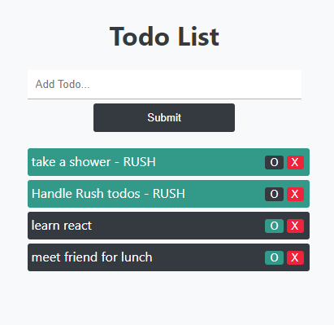

# MIT Todo List Application

## App Information

### Title: MIT Simple ToDo List

### Description

This assignment consist on building a todo list with React, using the state hooks and function components. The application handles the add, delete and rush functionalities. If the todo is marked as rush by clicking on the "circle" button, it will add different styles and add it to the top of the list. As well, it handles historical data by not completely removing the todo item, but instead marking as isDeleted and not showing in the UI. This approach allows expansion of the application, by adding "Done Todos" section, where it will show all these items.

### How to Run

Simply download the zip folder with the source code file, or fork it into your github and clone it into your machine, run npm install to get all the dependencies, and then run npm start to get it load in your browswer locally

### Future Adds

- UI modification (there's always room for improvements)
- Capability to track the number pending todos
- Section to see Completed todos

### Author

Kevin Grimaldi.
Student at MIT - Full Stack Development with MERN

### License

MIT License
